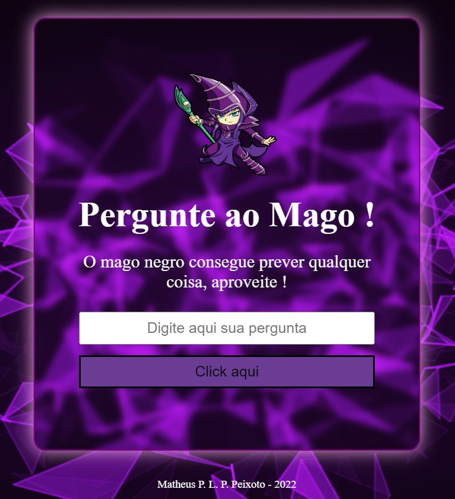

<h1 align="center">

</h1>

<strong>

Projeto feito na Maratona Explorer, evento criado pela Rocketseat

</strong>
 

<h2>Projeto: Pergunte ao Mago</h2>
 

O projeto é basicamente um site onde você faz uma pergunta qualquer ao mago e ele te responde de forma positiva, negativa ou até mesmo de forma neutra.
 
 
<h2>🛠 Tecnologias utilizadas: </h2>
<ul>
    <li>HTML</li>
    <li>CSS</li>
    <li>JavaScript</li>
</ul>
